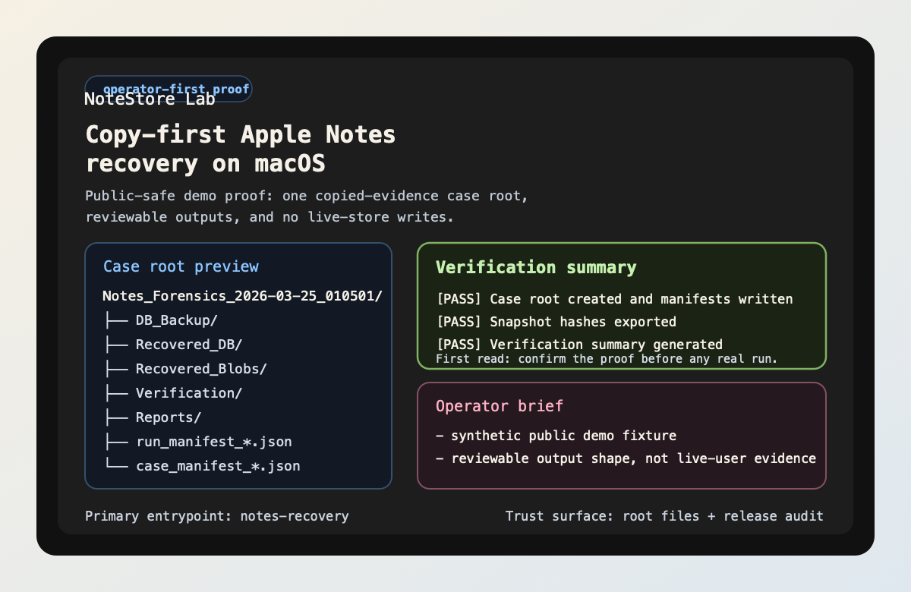

# Noteyard

<!-- mcp-name: io.github.xiaojiou176-open/noteyard-mcp -->

<p>
  
</p>

`noteyard` is the repository. **Noteyard** is the public
product name for the same copy-first Apple Notes recovery lab.

> Copy first. Prove the case path. Then let AI and local MCP review the same
> case root.
>
> Short copy-first path:
> `notes-recovery demo` -> `notes-recovery doctor`
>
> Repository identity: `noteyard` · Primary entrypoints:
> `notes-recovery` and `notes-recovery-mcp`

[](https://github.com/xiaojiou176-open/noteyard/releases)
[](./LICENSE)
[](https://github.com/xiaojiou176-open/noteyard/actions/workflows/ci.yml)

[Start Here](#start-here) ·
[Public Proof](./proof.html) ·
[Landing](https://xiaojiou176-open.github.io/noteyard/) ·
[Use Cases](./USE_CASES.md) ·
[Builder Guide](./INTEGRATIONS.md) ·
[Support](./SUPPORT.md)



*Public-safe proof block: one copied-evidence workflow, one timestamped case
root, and reviewable outputs for backup, recovery, verification, and reports.*

## At A Glance

If you want the shortest truthful filter before reading deeper, use this table:

| What you need to know | Current answer |
| --- | --- |
| Product thesis | a copy-first local Apple Notes recovery and review lab for macOS |
| First success | `notes-recovery demo` -> `notes-recovery doctor` |
| First proof | one timestamped synthetic case root plus a zero-risk host readiness check |
| Builder lane later | `notes-recovery-mcp` and [`INTEGRATIONS.md`](./INTEGRATIONS.md) after the operator path already makes sense |
| What it must never be reduced to | a hosted recovery portal, generic AI assistant, or multi-tenant review service |

## Start Here

Treat this repository like a lab bench, not a rescue button. Start by proving
the workflow shape on synthetic artifacts first:

```bash
notes-recovery demo
notes-recovery doctor
```

What this short path proves in under five minutes:

- one timestamped case root instead of ad hoc loose files
- a zero-risk first look that does not touch private evidence or a live Notes
  store
- a host-readiness verdict before you move on to a real copied-evidence run

If you want the second-ring synthetic review lane after that, continue with:

```bash
notes-recovery ai-review --demo
notes-recovery ask-case --demo --question "What should I inspect first?"
```

That second ring proves bounded AI review and evidence-backed case questioning
on the same synthetic case root.

If you are here for Codex / Claude Code integration, run the operator path
once, then jump to the [Builder Guide](./INTEGRATIONS.md). The builder lane is
real, but it is not the first thing a new operator should read.

Open the right next door after that first pass:

| If you want to... | Open this next | Why |
| --- | --- | --- |
| see the copy-first story and proof-path overview | [Landing](https://xiaojiou176-open.github.io/noteyard/) | this is the shortest product overview for a first-time visitor |
| separate repo proof from manual or platform tails | [Public Proof](./proof.html) | this is where "what is proved" and "what is still manual" are split cleanly |
| match your goal to the right workflow lane | [Use Cases](./USE_CASES.md) | it sorts operator, AI review, MCP, and case-diff jobs without mixing them |
| reuse the same case root in Codex / Claude Code | [Builder Guide](./INTEGRATIONS.md) | builder reuse is real, but it still comes after the operator path |

## Current lane order

- **Primary**: the local copy-first recovery lab on one explicit case root
- **Primary extension**: `notes-recovery-mcp` as the repo's `pure_mcp` review
  surface
- **Secondary**: `public-skills/noteyard-case-review/` as the standalone
  `pure_skills` packet for host-native reviewers; its secondary ClawHub packet
  listing is live, but it still stays behind the landing/proof route
- **Later / companion**: plugin bundles, deeper package/registry detail,
  Docker/GHCR, and Glama metadata after the local case path already makes
  sense
- **Current non-claims**: no hosted Notes recovery service, no multi-tenant
  review portal, and no live OpenHands/extensions/Glama/Docker catalog listing
  language in the front-door sentence
- **Current review tail**: OpenHands/extensions is submission-done with
  changes requested, so keep that lane in platform review until a live
  read-back exists

Deep reads once the first path makes sense:
[LLMs Guide](./llms.txt) · [Distribution](./DISTRIBUTION.md) ·
[Use Cases](./USE_CASES.md) · [Ecosystem Fit](./ECOSYSTEM.md)

## What It Is

Noteyard is a local Apple Notes recovery toolkit for **macOS**.
It is built around one rule: work on copied evidence, not the live Notes store.

The CLI-first chain stays intentionally simple:

`notes-recovery CLI -> parser/handlers -> services -> core pipeline -> timestamped case outputs`

The builder-facing chain is just as important:

`case root + manifests + review artifacts + notes-recovery-mcp`

That is the current external substrate for local agents and builder tooling.
It is real today. A hosted API or generated SDK is not.

For the exact repo-side proof, remote read-back proof, and manual external
boundary, use [Public Proof](./proof.html).

## What It Is Not

| This repository is for | This repository is not for |
| --- | --- |
| Apple Notes incidents on **macOS** | A cloud service |
| Copy-first local recovery and forensic review | A Notes replacement app |
| Operators who want manifests, reports, and reviewable outputs | A cross-platform recovery library |
| Teams who prefer inspectable steps over ad hoc edits | A guarantee that every deleted-data case is recoverable |

## Why AI / Agent Users Care

This repository is not a generic AI assistant. It is closer to a forensic
workbench with a bounded AI copilot layered on top.

The highest-value AI / agent cuts already shipped are:

| Surface | Current role in the workflow | Why it matters |
| --- | --- | --- |
| `notes-recovery ai-review` | evidence summarizer and triage assistant | turns one case root into findings, next questions, and operator priorities |
| `notes-recovery ask-case` | operator next-step assistant | answers one bounded question from derived artifacts and cites the evidence |
| `notes-recovery case-diff` | replay / compare diagnosis substrate | compares two case roots at the manifest and review-surface layer |
| `notes-recovery-mcp` | local agent access surface | lets Codex / Claude Code style local agent workflows consume case roots safely |

These surfaces live on the main workflow. They are not detached chat panels.

## What You Can Prove Today

| Proof | Command | What it proves |
| --- | --- | --- |
| Public-safe workflow shape | `notes-recovery demo` | the repo already ships a zero-risk synthetic case surface |
| AI review layer | `notes-recovery ai-review --demo` | AI exists as a review assistant on derived artifacts |
| Evidence-backed case Q&A | `notes-recovery ask-case --demo --question "What should I inspect first?"` | case questioning is real and cites review-safe sources |
| Agent protocol surface | `notes-recovery-mcp --case-dir <case-root>` | MCP access exists as a local stdio-first case-root interface |
| Compare / replay substrate | `notes-recovery case-diff --dir-a <case-root> --dir-b <case-root>` | the repo can compare two case roots without diffing raw copied evidence |
| Optional plugin contract | `notes-recovery plugins-validate --config <plugins.json>` | optional tool integrations are validated before you trust them, including host-safety screening |

## Why Trust This

- **Copy-first by default**: the documented workflow operates on copied case roots, not the live Notes store.
- **Reviewable outputs first**: manifests, verification outputs, reports, timelines, and text bundles stay inspectable by humans.
- **AI is bounded**: `ai-review` and `ask-case` stay on derived artifacts first, and cloud-backed OpenAI remains explicit opt-in.
- **MCP is bounded**: `notes-recovery-mcp` is local `stdio` first, read-only / read-mostly, and case-root-centric instead of host-control by default.

## Host Safety Boundary

This repository is a copied-evidence workbench, not a host-control utility.

That means the tracked code and automation must not introduce:

- broad host cleanup routines for shared apps, browsers, Notes, or Docker
- shared-process termination helpers such as `killall`, `pkill`, `kill -9`,
  `os.kill(...)`, or `process.kill(...)`
- desktop-wide automation such as `osascript`, `System Events`,
  `AppleEvent`, `loginwindow`, or Force Quit flows

The allowed local scope stays intentionally narrow:

- copied evidence inside timestamped case roots
- repo-local rebuildable surfaces such as `.venv/` and `.runtime-cache/`
- user-invoked previews of repo-owned output paths

## Quickstart

### Choose your path

| If you want to... | Start here | Why |
| --- | --- | --- |
| get a zero-risk first look | `notes-recovery demo` | it shows the public-safe demo surface without touching private evidence or a live Notes store |
| preview AI-assisted review on synthetic data | `notes-recovery ai-review --demo` | it generates triage, findings, and next-step questions from public-safe demo artifacts |
| ask one evidence-backed question about the synthetic review surface | `notes-recovery ask-case --demo --question "What should I inspect first?"` | it answers from tracked derived demo artifacts and cites which surfaces it used |
| check whether this host is ready for a real copied-evidence run | `notes-recovery doctor` | it confirms the host boundary and tells you whether to stay on demo or move to a real copied-evidence run |
| browse a richer local review cockpit | `forensics-dashboard` | it gives you case-root selection, resource inventory, AI quick view, and bounded case-diff without becoming a hosted portal |
| run the standard copied-evidence workflow | `notes-recovery auto --out ... --report --verify --recover --keyword ...` | it builds one timestamped case root with recovery, review, and manifest outputs |
| share a safer review bundle later | `notes-recovery public-safe-export --dir <case-root> --out ./output/public_safe_bundle` | it creates a redacted sharing layer instead of exposing the forensic-local case root |

### Fastest zero-risk try

Start with the tracked public demo before you point the toolkit at any copied
evidence of your own:

```bash
python -m venv .venv
source .venv/bin/activate
python -m pip install -e .[dev]
notes-recovery demo
notes-recovery ai-review --demo
notes-recovery ask-case --demo --question "What should I inspect first?"
notes-recovery doctor
notes-recovery --help
```

Expected first-look signals:

- the command prints `Noteyard public demo`
- `notes-recovery ai-review --demo` generates a synthetic triage summary,
  findings, and next-step questions
- `notes-recovery ask-case --demo ...` returns an evidence-backed answer with
  cited derived surfaces
- `notes-recovery doctor` tells you whether the host is ready for a real
  copied-evidence run
- you see a case tree preview, a verification preview, and an operator brief
- nothing touches private evidence or a live Notes store
- the demo surface gives you one coherent story: workflow shape, AI proof, and
  bounded questioning on the same synthetic material

### Run against your own copied evidence

Only do this on a copy of Apple Notes data, never the live original store.

Before the first real copied-evidence run, start with:

```bash
notes-recovery doctor
```

That preflight step helps you decide whether this host is ready for the
standard copied-evidence workflow, whether you should stay on `demo`, or
whether you only need to install optional extras.

If you want AI-assisted review on a real case, keep the boundary clear:

```bash
python -m pip install -e .[ai]
notes-recovery ai-review \
  --dir ./output/Notes_Forensics_<run_ts> \
  --provider ollama \
  --model llama3.1:8b
```

The AI assistant reads review artifacts such as manifests, pipeline summaries,
verification outputs, timelines, reports, and review indexes. It does **not**
default to uploading raw copied evidence or the live Notes store to a cloud
provider.

If you want to ask one bounded, evidence-backed question about the same case,
use:

```bash
notes-recovery ask-case \
  --dir ./output/Notes_Forensics_<run_ts> \
  --question "Which artifact should I inspect first?"
```

That command stays on derived case artifacts and returns:

- an answer
- evidence references
- confidence / uncertainty
- suggested next inspection targets

If you want a richer local review surface after the CLI proof path, install the
optional dashboard extras and launch the review cockpit:

```bash
python -m pip install -e .[dashboard]
forensics-dashboard
```

The review cockpit stays local-first and case-root-centric. It can browse
multiple case roots, preview the review index and AI outputs, inventory derived
resources, and render a bounded `case-diff` summary without turning the repo
into a hosted review portal.

```bash
notes-recovery auto \
  --out ./output/Notes_Forensics \
  --report \
  --verify \
  --recover \
  --keyword "your distinctive keyword"
```

That workflow:

1. copies evidence into a timestamped case root
2. runs selected recovery and analysis stages on the copy
3. writes outputs, manifests, logs, and a `review_index.md` guide into that case directory

You can also run stages individually with commands such as `snapshot`, `query`,
`recover`, `verify`, `report`, `plugins-validate`, `case-diff`, and `fts-index`.

## AI-Assisted Review

`notes-recovery ai-review` is the first AI surface in this repository.

- It is a **review assistant**, not a recovery engine.
- It reads **derived review artifacts first**.
- It can generate:
  - `triage_summary.md`
  - `top_findings.md`
  - `next_questions.md`
  - `artifact_priority.json`
- The synthetic proof path is:
  - `notes-recovery ai-review --demo`
- The local-first real-case path is:
  - `python -m pip install -e .[ai]`
  - `notes-recovery ai-review --dir <case-root> --provider ollama --model <model>`
- A cloud-backed provider is available only through explicit opt-in:
  - set `NOTES_AI_OPENAI_API_KEY`
  - run `notes-recovery ai-review --dir <case-root> --provider openai --model <model> --allow-cloud`

The stable case-root contract for those directories and manifests is documented
in [CONTRIBUTING.md](./CONTRIBUTING.md#case-root-contract).

## Protocol Surfaces

Round 4 adds the first protocol-facing surfaces for agents and external tools:

- `notes-recovery ask-case --dir <case-root> --question "..."`
- `notes-recovery-mcp --case-dir <case-root>`

Those protocol surfaces keep the same product boundary:

- they stay on copied-evidence case roots
- they prefer derived review artifacts over raw evidence
- they do not expose the live Notes store as a default input
- the MCP server starts with local `stdio` transport instead of a hosted service
- they are protocol surfaces, not a hosted review portal or agent platform

## For Builders And Local Agents

The current builder story is intentionally narrow and stable:

Treat this whole section as a later builder lane around the local lab. It is
real and useful, but it is not the front-door sentence a new reviewer should
use to describe the product.

- use the **case root contract** as the file-system-level substrate
- use manifests, summaries, verification previews, and AI review outputs as the
  shared read layer
- use `notes-recovery-mcp` when you want a case-root-centric tool/resource
  interface instead of scraping files ad hoc

If your local coding-agent host supports stdio MCP servers, the stable command
to register is:

```bash
.venv/bin/python -m notes_recovery.mcp.server --case-dir ./output/Notes_Forensics_<run_ts>
```

Use that command inside Codex / Claude Code style local MCP registration flows.
The host-specific JSON wrapper can vary, but the executable contract is the
same: local stdio, read-mostly, case-root-centric.

If you want copy-paste-safe wrapper sketches, the builder guide and shipped
distribution artifacts now include:

- a project `.codex/config.toml` starter for Codex
- a project `.mcp.json` wrapper example for Claude Code
- a Codex plugin bundle
- a Claude Code plugin bundle plus Git-backed marketplace manifest
- an OpenClaw-compatible bundle build path that keeps the same executable
  contract without claiming a live listing

Those public-ready surfaces live under `plugins/`, `.claude-plugin/`, and
`server.json`. Package the installable archives with:

```bash
.venv/bin/python scripts/release/build_distribution_bundles.py --out-dir ./dist
```

For the MCP lane specifically, `server.json` is the repo-owned descriptor
around the same local stdio case-review workflow. Package publication,
registry read-back, and marketplace/manual submission status can drift over
time, so this README keeps the primary story on the local bench first. Use
[DISTRIBUTION.md](./DISTRIBUTION.md) when you need the later-lane claim
boundary.

The repository now also ships a canonical independent skill surface at
`skills/noteyard-case-review/`. Treat that directory as the SSOT skill
package, and treat the plugin/starter skill files as host-specific derived
copies. That makes the skill independently referenceable without pretending it
has already cleared any external directory gate.

For OpenHands/extensions and ClawHub-style submissions, the repo now also ships
an OpenHands/extensions-friendly public skill folder at
`public-skills/noteyard-case-review/`. Treat that packet as the
portable listing lane, while `skills/noteyard-case-review/` remains the
canonical skill text.

When you want the repo-side metadata/build-readiness gate before the next PyPI
version bump, run:

```bash
.venv/bin/python scripts/release/check_pypi_publish_readiness.py
```

Practical host notes:

- Codex and Claude Code are both good current examples of hosts that fit the shipped local stdio MCP contract here.
- Keep the executable command above as the source of truth even when each host wraps it differently.
- Treat remote-connector-first hosts as comparison paths here because this repo does not ship a hosted or remote MCP deployment.
- OpenClaw-style hosts stay in the comparison bucket for now, but this repo now ships an OpenClaw-compatible bundle build path instead of only a docs-only comparison note.
- The safest integration smoke is still `demo` -> `ask-case --demo` -> the exact `notes_recovery.mcp.server` command.

Current integration fit:

- **Primary fit**: MCP, Codex, Claude Code
- **OpenHands/extensions-friendly public skill folder**: `public-skills/noteyard-case-review/`
- **Secondary / comparison fit**: OpenCode
- **Not a primary front-door claim**: OpenClaw, hosted portals, generic AI-agent platforms

Builder-facing status today:

| Surface | Status | What to use today |
| --- | --- | --- |
| HTTP API | not shipped | use CLI + case roots + MCP |
| OpenAPI contract | not shipped | use documented case-root artifacts and MCP tool/resource names |
| shared generated client | not shipped | use the local MCP surface or parse manifests directly |
| thin SDK | not shipped | future path only, after the shared case/MCP contract is locked |
| repo-owned host bundles | companion packaging | use `plugins/`, `.claude-plugin/`, `server.json`, and `scripts/release/build_distribution_bundles.py` after the local MCP story is already clear |
| canonical independent skill surface | secondary current lane | use `skills/noteyard-case-review/` as the only SSOT skill surface; plugin/starter copies are derived packaging |
| OpenHands/extensions-friendly public skill folder | portable secondary packet | use `public-skills/noteyard-case-review/` for OpenHands/extensions or ClawHub-style skill submissions without turning it into the repo's main front door |
| official marketplace/catalog listing | Wave 2 external validation | repo-owned artifacts do not imply official listing or publish read-back |

## Docker And Catalog Later Surface

The Docker story is intentionally narrow and secondary:

- it is a Docker-ready local container surface around the same case-root
  workflow
- it is a companion packaging lane, not the primary front door
- it is not a hosted service
- it keeps the MCP path on local `stdio`
- it expects copied case roots or demo mode, not a live Notes store

Build the image:

```bash
docker build -t noteyard:0.1.0.post1 .
```

Run the public-safe demo:

```bash
docker run --rm noteyard:0.1.0.post1 notes-recovery demo
```

Run the MCP help surface:

```bash
docker run --rm --entrypoint notes-recovery-mcp noteyard:0.1.0.post1 --help
```

Review an existing copied case root through the local stdio MCP server:

```bash
docker run --rm -i \
  -v "$PWD/output:/cases:ro" \
  --entrypoint notes-recovery-mcp \
  noteyard:0.1.0.post1 \
  --case-dir /cases/Notes_Forensics_<run_ts>
```

The container image is a reproducible local runtime, not a hosted portal, not
an API gateway, and not proof of any live Glama or OCI catalog listing.

The repo-side Glama metadata surface is now explicit as well:

- `glama.json`
- `Dockerfile`
- `ghcr.io/xiaojiou176-open/noteyard:0.1.0.post1`

That is enough to prepare a Glama Add Server submission or a Docker-first
catalog conversation. It is still not proof of a live Glama listing until fresh
Glama-side read-back exists.

Use the dedicated builder notes in [INTEGRATIONS.md](./INTEGRATIONS.md) and the
ecosystem binding matrix in [ECOSYSTEM.md](./ECOSYSTEM.md) before you describe
the repo as an integration substrate. Use [DISTRIBUTION.md](./DISTRIBUTION.md)
when you need the exact claim boundary for Codex, Claude Code, OpenClaw, and
the MCP Registry.

## Repo-native support cleanup

This repository now ships a small repo-native cleanup lane for local release and
rewrite residue. Use it when you want to reclaim repo-local staging artifacts
without touching copied evidence, `output/`, Docker state, browser profiles, or
shared machine caches.

```bash
python scripts/ops/clean_support_state.py --dry-run
python scripts/ops/clean_support_state.py --apply
```

Current cleanup classes include:

- `.runtime-cache/pypi-release`
- `.runtime-cache/history-rewrite-*`
- `.runtime-cache/release`
- `.runtime-cache/pypi-publish-attempt-*`
- `.runtime-cache/lighthouse-pages*`
- `.runtime-cache/security-audit`
- `.runtime-cache/temp`
- `.runtime-cache/dist-bundles`
- `.runtime-cache/*starter*.zip`
- `.runtime-cache/verify-*`
- `.runtime-cache/gitleaks-*.json`

Treat this as a maintainer-only lane. It is for support residue, not for copied
evidence or public proof assets.

## Plugin Contract And Case Diff

Two previously parked operator utilities are now first-class repo-side
surfaces:

- `notes-recovery plugins-validate --config <plugins.json>`
  - validates the local plugin contract before you trust optional external tools
  - reports contract failures, placeholder commands, and host dependency gaps
- `notes-recovery case-diff --dir-a <case-root> --dir-b <case-root>`
  - compares two case roots at the manifest and derived review-surface layer
  - stays on case-level manifests and review artifacts instead of diffing raw copied evidence

## Current Public Truth

The GitHub repository page and the root-level contract files are the current
public truth for this project.

Use `DISTRIBUTION.md` as the later-lane ledger for package, registry, plugin,
Docker, and Glama details. Those surfaces are real, but they should not replace
the copy-first local lab story in the first paragraph a reviewer reads.

Right now:

- a public-safe demo is available in this repository
- the GitHub Release page and the GitHub Pages landing are the main public
  proof surfaces around the repo
- fresh distribution read-back exists for the MCP package lane, the PyPI
  package lane, and the secondary ClawHub skill packet; keep those as support
  receipts instead of the first sentence a new reviewer sees
- `llms.txt`, `robots.txt`, and `sitemap.xml` now expose the current public contract to AI crawlers and search engines without pretending the repo is an API platform
- GitHub description, topics, and custom social preview status should be treated
  as GitHub Settings items, not repository facts

Use [CHANGELOG.md](./CHANGELOG.md) for tracked milestone history and the
[Releases](https://github.com/xiaojiou176-open/noteyard/releases)
page for the published GitHub release feed and the synthetic public demo bundle.

The current repo-owned public contract is:

- README and root-level contract files are current
- the GitHub Pages landing should match the same shipped story as the README
  hero
- `llms.txt`, `robots.txt`, and `sitemap.xml` are repo-owned public contract
  files, not platform-acceptance receipts
- `llms.txt` is now the fastest AI-crawler / agent-reader entrypoint for the current shipped public contract
- custom social preview still requires a GitHub Settings upload plus REST
  `open_graph_image_url` read-back before you claim a custom card is live

## Trust Surface

### Supported boundary

- **Host OS:** macOS
- **Workflow style:** local forensic workflow on copies, not live in-place editing
- **Core rule:** do not operate on the original live Notes store

### Public contract files

The root-level public contract for this repository is intentionally narrow:

- [README.md](./README.md)
- [CONTRIBUTING.md](./CONTRIBUTING.md)
- [SECURITY.md](./SECURITY.md)
- [SUPPORT.md](./SUPPORT.md)
- [LICENSE](./LICENSE)
- [CODEOWNERS](./CODEOWNERS)
- [AGENTS.md](./AGENTS.md)
- [CLAUDE.md](./CLAUDE.md)
- [.env.example](./.env.example)

### Baseline verification contract

The repository keeps a narrow baseline smoke contract that matches the hosted
baseline lane, not the entire CI matrix. The canonical baseline smoke and full
suite commands live in
[CONTRIBUTING.md](./CONTRIBUTING.md) so the public front door stays brief while
the detailed verification contract stays in one place.

That baseline smoke proves:

- the installed CLI entrypoint resolves correctly
- the public-safe demo surface prints a non-empty first-look narrative
- the core `.[dev]` pipeline surface runs on macOS in CI

Tracked public proof should come from one of two places only:

- the synthetic demo resources shipped under `notes_recovery/resources/demo/`
- a redacted bundle generated with `notes-recovery public-safe-export`

### Hosting audit boundary

Public release readiness is not just about the current working tree. The
repository audit explicitly reviews git history, pull request diffs, forks,
mirrors, downloaded clones, branch protection, required pull request reviews,
secret scanning, and hosting settings for the `xiaojiou176-open` canonical
repository.

Use `scripts/ci/check_release_readiness.py --strict` instead of assuming those
open-source boundary checks are still current from memory.

### Runtime hygiene boundary

This public front door is **relocation-safe at the repo level**, but it is
**not environment-agnostic at the host level** because the supported workflow
still assumes macOS and copied Apple Notes evidence.

Treat the root-level files as the active **repository contract** and the
repository root as the **stable control surface** for commands, review notes,
and public-safe demo artifacts.

Tracked **runtime artifacts** do not belong in the public tree. `examples/ is intentionally excluded`, and `.runtime-cache/` remains a **reserved, non-public staging area** for local support work instead of published proof.

The local `.venv/` directory is a repo-local rebuildable developer surface.
Treat it like a reusable tool belt, not like source or forensic evidence:

- it is safe to remove when you explicitly want to reclaim local disk
- it must not be committed
- deleting it means you must recreate it with the documented development setup
  before running repo checks again

Repo-local rebuildable tooling follows the same boundary:

- `.venv/` is a local support surface, not repository truth
- deleting `.venv/` is a safe local maintenance action when you intend to
  recreate the development environment
- recreate it with `python -m venv .venv` plus `python -m pip install -e .[dev]`

## Optional Surfaces

Optional surfaces remain opt-in:

- `.[ai]` for local AI-assisted review via Ollama
  or explicit cloud opt-in via OpenAI
- `.[mcp]` for the local read-mostly MCP server
- `.[dashboard]` for the Streamlit review cockpit, case-root selection, and bounded case-diff view
- `.[carve]` for deeper payload carving support

Do not assume one mixed environment is the canonical developer contract.

Install them explicitly when you need those extras:

```bash
python -m pip install -e .[ai]
python -m pip install -e .[mcp]
python -m pip install -e .[dashboard]
python -m pip install -e .[carve]
```

If you want the richer local review cockpit for one case root:

```bash
python -m pip install -e .[dashboard]
forensics-dashboard
```

The `dashboard` and `carve` surfaces stay visible, but they are not part of the
default baseline guarantee.

AI review is also boundary-aware:

- `notes-recovery ai-review --demo` works on tracked synthetic review artifacts
- `notes-recovery ask-case --demo ...` stays on tracked synthetic review artifacts
- real-case AI review reads derived outputs from an existing case root
- real-case `ask-case` cites derived artifacts instead of returning an unsupported freeform answer
- the first real provider is local-first via Ollama
- the cloud-backed OpenAI path requires explicit opt-in via `--allow-cloud`
- it is not part of the default baseline guarantee

The MCP surface is also boundary-aware:

- `notes-recovery-mcp` starts with local `stdio` transport
- it exposes case-centric resources and bounded derived-output tools
- it does not default to broad filesystem browsing or live-store actions
- it is not part of the default baseline guarantee

Some workflows also rely on opt-in integrations such as `docker`,
`sqlite_dissect`, `strings`, and `binwalk`. Those remain optional local tools,
not part of the default baseline guarantee.

For deeper changes, use the broader full suite engineering sweep documented in
[CONTRIBUTING.md](./CONTRIBUTING.md). That full suite signal remains useful
engineering coverage, but it is not the default baseline CI guarantee.

## Public-Safe Export

Use `notes-recovery public-safe-export --dir <case-root> --out ./output/public_safe_bundle`
when you need a shareable review bundle from an existing case root. The export
is intentionally metadata-focused:

- it redacts host-specific runtime fields and absolute paths
- it keeps the original forensic-local case root unchanged
- it omits raw evidence-heavy directories from the public-safe bundle

## Repository Links

- [Landing page](https://xiaojiou176-open.github.io/noteyard/)
- [LLMs guide](./llms.txt)
- [Changelog](./CHANGELOG.md)
- [Use Cases](./USE_CASES.md)
- [Ecosystem Fit](./ECOSYSTEM.md)
- [Builder Guide](./INTEGRATIONS.md)
- [Issue tracker](https://github.com/xiaojiou176-open/noteyard/issues)
- [Support guide](./SUPPORT.md)
- [Security policy](./SECURITY.md)
- [Contributing guide](./CONTRIBUTING.md)

## Why Star

Star this repository if you want a copy-first Apple Notes recovery workflow
with reviewable case outputs, a public-safe demo, and a tighter trust surface
than an ad hoc “open the SQLite file and hope” approach.
